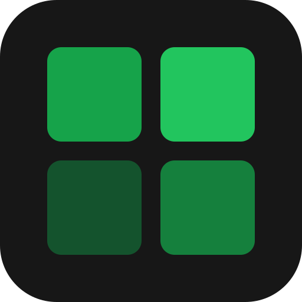
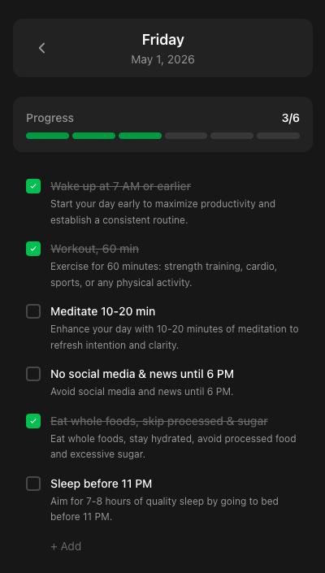
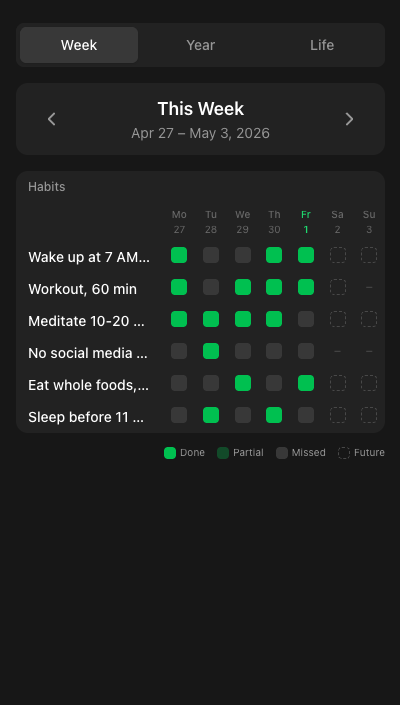
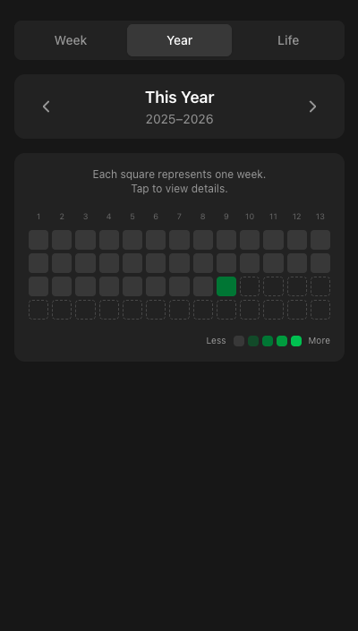
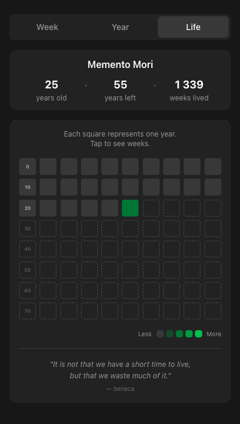

<div align="center">
  

# OpenHabit

[](https://github.com/nikfedorov/openhabit/actions/workflows/tests.yml)
[](https://github.com/nikfedorov/openhabit/actions/workflows/tests.yml)

Habit tracker with AI integration and a Telegram bot.

</div>

<div align="center">
  
  
  
  
</div>

## About

OpenHabit is a web application for tracking daily habits, keeping notes, and analyzing your progress with the help of AI. It supports notifications, flexible schedules (RRULE), multi-language UI (ar, bn, en, es, hi, pt, ru, zh) and payments through Telegram.

### Key features

- **Habits & templates** — categories, habit templates, flexible schedules powered by `rlanvin/php-rrule`.
- **AI integration** — `AiDigest`, `AiLog`, `AiModel`, `AiTone`, per-user memory (`UserMemory`).
- **Telegram bot** — built on `nutgram/laravel` (commands, callbacks, handlers, payments).
- **Reactive frontend** — Vue 3 (Composition API) + Tailwind v4 + Vite.
- **Queues & observability** — Laravel Horizon, Pulse, Telescope, Pail.
- **API** — documented via `dedoc/scramble`, schema in [resources/js/api-schema.json](resources/js/api-schema.json).

## Stack

- PHP 8.5, Laravel 13, Octane (FrankenPHP)
- Vue 3, Vue Router, Tailwind 4, Vite (vite-plus)
- Pest 4, PHPStan/Larastan 3, Pint, Rector
- Sail (Docker) for local development

## Structure

```
app/
  Actions/          # Business logic (Action pattern, see AGENTS.md)
  Console/Commands/ # Artisan commands
  Http/             # Controllers, API resources
  Jobs/             # Queue jobs
  Models/           # Eloquent models
  Notifications/    # Notifications
  Services/         # Services
  Telegram/         # Bot: Commands, Callbacks, Handlers
resources/
  js/               # Vue app and api-schema.json
  views/            # Blade + Livewire
  css/              # Tailwind
lang/               # Translations (8 languages)
tests/              # Pest: Feature, Unit, Browser
```

## Local setup

Docker is required. All commands run through Laravel Sail.

### First-time install

```bash
./scripts/local.sh
```

The script will:

1. Copy `.env.example` → `.env`.
2. Install Composer dependencies via a one-shot Docker container.
3. Build Sail images (`sail build`).
4. Install Octane with FrankenPHP.
5. Start the containers (`sail up -d`) and create `storage:link`.
6. Generate `APP_KEY` (if not set).
7. Run `migrate:fresh --seed`.
8. Install npm dependencies via Bun and build the frontend.

For a full rebuild that wipes volumes:

```bash
./scripts/local.sh --rebuild
```

The app will be available at <http://localhost>.

### Development

Run all the workers you need (Horizon, Pail, Vite, scheduler) in a single command:

```bash
vendor/bin/sail composer dev-full
```

Without Vite (when the frontend isn't being rebuilt):

```bash
vendor/bin/sail composer dev
```

Useful commands:

```bash
vendor/bin/sail up -d                 # Start containers
vendor/bin/sail stop                  # Stop containers
vendor/bin/sail artisan migrate       # Run migrations
vendor/bin/sail bun run dev           # Vite in dev mode
vendor/bin/sail bun run build         # Build frontend
vendor/bin/sail artisan horizon       # Queues
vendor/bin/sail artisan pail          # Live logs
```

## Production deployment

Docker and Git are required on the server.

### First-time setup

```bash
git clone https://github.com/nikfedorov/openhabit.git && cd openhabit
./scripts/prod.sh
```

The script will interactively ask for the app URL, Telegram Bot Token, and OpenRouter API key, then handle everything:

1. Create `.env` with production defaults. The database password is generated automatically — check `.env` after the first run.
2. Install Composer dependencies (`--no-dev`).
3. Build the production Docker image (`docker/production/Dockerfile`).
4. Start all containers with `restart: unless-stopped`.
5. Generate `APP_KEY`, create `storage:link`, run migrations.
6. Cache config, events, routes, and views.
7. Build frontend assets via Bun.
8. Restart workers so they pick up the fresh config cache.

### Subsequent deployments

```bash
./scripts/prod.sh
```

On re-runs the `.env` already exists so no prompts appear — it goes straight to `git pull` and redeploy.

### Services running in production

All daemons are managed by Supervisor inside a single container:

| Process | Command |
|---|---|
| **Octane** (FrankenPHP) | `artisan octane:start --server=frankenphp --port=80` |
| **Horizon** | `artisan horizon` |
| **Pulse** | `artisan pulse:work` |
| **Scheduler** | `while true; do artisan schedule:run; sleep 60; done` |

### Useful production commands

```bash
docker compose -f compose.prod.yaml logs -f app               # Tail all logs
docker compose -f compose.prod.yaml exec app php artisan horizon:status
docker compose -f compose.prod.yaml exec app php artisan pulse:status
docker compose -f compose.prod.yaml exec app php artisan migrate --force
docker compose -f compose.prod.yaml down                      # Stop everything
```

`scripts/prod.sh --fresh` re-seeds the database and re-registers the Telegram webhook.

## Testing & code quality

Full run (type coverage, lint, tests, static analysis, API schema, Vue):

```bash
vendor/bin/sail composer test
```

Individual steps:

```bash
vendor/bin/sail composer test:app             # Pest with 100% coverage
vendor/bin/sail composer test:types           # PHPStan (Larastan)
vendor/bin/sail composer test:lint            # Pint + Rector + Vue lint
vendor/bin/sail composer test:type-coverage   # 100% type coverage
vendor/bin/sail composer test:vue             # Vitest + vue-tsc
vendor/bin/sail composer test:suites          # Per-layer coverage (Actions, Jobs, Services, ...)
```

Run a specific test quickly:

```bash
vendor/bin/sail artisan test --compact --filter=TestName
```

Auto-fixes:

```bash
vendor/bin/sail composer lint                 # Pint + Rector + Vue formatter
```

## AI configuration

By default the project ships with **DeepSeek via OpenRouter** as the active model. No extra setup is needed beyond setting `OPENROUTER_API_KEY` in your `.env`.

### Managing models

Models are stored in the database and can be added or removed interactively:

```bash
vendor/bin/sail artisan app:add-ai-model    # Add a model
vendor/bin/sail artisan app:remove-ai-model # Remove a model
```

### Adding other providers

Set the relevant API key(s) in `.env` and select the corresponding provider when adding a model:

```ini
ANTHROPIC_API_KEY=
AZURE_OPENAI_API_KEY=
DEEPSEEK_API_KEY=
GEMINI_API_KEY=
GROQ_API_KEY=
MISTRAL_API_KEY=
OLLAMA_API_KEY=
OPENAI_API_KEY=
OPENROUTER_API_KEY=
XAI_API_KEY=
```

## Conventions

The project follows an Action-class architecture (`app/Actions`) with a single `handle()` method per action. Detailed rules and active skills are in [AGENTS.md](AGENTS.md).

In short:

- Business logic lives in Action classes, reused from controllers, commands, jobs, and the bot.
- Strict typing (`declare(strict_types=1)`), `final readonly` where appropriate.
- 100% test and type coverage. No `@phpstan-ignore` or `@codeCoverageIgnore` (except in rare, justified cases).
- Tests mirror the `app/` structure: one test file per class.
- Frontend: Vue 3 Composition API + `<script setup>` + TypeScript.

## License

MIT.
